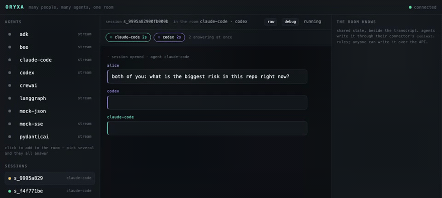

# Oryxa

**Multiplayer AI — many people and many agents in one room, live.**

Your Claude Code session and your colleague's Codex session are two private
terminals that will never know about each other. Oryxa puts them in the same
room, on the same question, in front of the same people. Neither CLI was
modified, and neither knows the other is there.



*Recorded from a real session. The script that produces it is in
[recording/](recording), so it is re-run after a change rather than performed
again by hand.*

[](LICENSE)
[](Cargo.toml)
[](CONTRIBUTING.md)

---

## Try it

```bash
curl -fsSL https://oryxa.in/install.sh | sh
oryxa
```

`oryxa` is the room view: your rooms, the transcript live as several agents
answer at once, and a box to talk to them. **With no server to talk to it starts
one**, in-process, against a durable file in your own data directory — so this
works on a machine with nothing else installed, and the rooms are still there
tomorrow. `--server` points it at a real one instead.

What it does not come with is agents. A connector is a **file** describing HTTP
calls, and yours live in `~/.config/oryxa/connectors` — or in `./connectors`,
which is what the room view reads when you run it inside a clone:

```bash
git clone https://github.com/Oryxa-Vault/oryxa && cd oryxa
cargo run --bin mockagent &     # a stand-in agent on :9000
cargo run --bin oryxa
```

Every connector in that directory is a working example. Press `n`, pick
`mock-sse` with `space`, and talk to it.

**As two people:** the viewer is embedded in the binary and served at the same
address as the API, so a colleague can watch the same room in a browser tab.
`oryxa key <room> <name>` issues them a key that speaks as a name rather than
claims one.

## Claude Code and Codex in one room

Both signed in. ACP is the preferred transport, and the adapters are the same
ones an editor launches — pinned to the versions the ACP registry names, so a
room and an editor are running identical agents:

```bash
export ORYXA_NPX=$(command -v npx)            # any Node 20+ install
export ORYXA_NODE_PATH=$(dirname "$ORYXA_NPX")
export ORYXA_WORKSPACE=/a/checkout/you/can/throw/away

oryxa check codex-local                       # a real turn, before a room
oryxa serve &
oryxa open claude-code-local codex-local
```

`oryxa which <agent>` prints what those variables resolved to, because an unset
one renders as nothing and fails at spawn time with an error about a program
called `""`.

The shim remains the fallback for command-line agents that do not speak ACP:

```bash
export ORYXA_SHIM_TOKEN=$(openssl rand -hex 32)
oryxa-shim -agents shim.yaml &     # same shell — both processes need the token
oryxa serve &
oryxa open claude-code codex
```

> **Both agents can write inside their working directory**, and they are
> confined differently — Codex by the OS sandbox, Claude Code by path patterns
> only. Anyone who can reach that room can cause writes to that directory. Point
> it at a checkout you can throw away. [SECURITY.md](SECURITY.md) has the
> detail.

ACP is now the preferred local transport for compatible coding agents. One
long-lived ACP subprocess and session belongs to each room-agent lane, so turns
stay ordered within an agent while separate agents continue in parallel. ACP
session IDs are stored in the event log and loaded again after a server restart.
The protected shim above remains the fallback.

Start from
[`connectors/templates/acp-coding-agent.yaml`](connectors/templates/acp-coding-agent.yaml),
set `ORYXA_WORKSPACE` to an absolute workspace path, and copy the template into
your connector directory before running it. ACP commands are accepted only from
operator-controlled files, never from the runtime registration API. **Permission
requests stop the room view and ask**, with the agent's exact options; the
answer is delivered to the waiting lane, recorded in the event log, and
reflected everywhere the room is open. From a script, that is `oryxa approve`.

## In your editor

Zed's agent panel can be a seat in the room. `oryxa acp` is Oryxa as an ACP
agent, so one panel session is one room:

```json
"agent_servers": {
  "Oryxa": { "command": "/path/to/oryxa", "args": ["acp", "--agents", "claude-code-local,codex-local"] }
}
```

You ask a question in the editor and several agents answer, attributed. A
colleague types in a terminal and it appears in your panel, with the agents'
replies to *them*. It is the same room, the same log, and the same permission
prompts — the seat is a view, not a copy.

## Connect your own agent

An HTTP connector is a **description of HTTP calls**, not code. One file, no
programming.

```yaml
name: my-agent
base: http://localhost:5000

turn:
  method: POST
  path: /run
  body:
    prompt: "{{input}}"
  response:
    format: json
    text:
      - $.output          # tried in order, first match wins
```

Drop it in `./connectors/`, then:

```bash
oryxa check my-agent      # runs a real probe turn and says what came back
```

`check` reports reachability, timing, whether your selectors matched, and
warnings for the ways a connector can pass while being quietly wrong. It answers
*is it me or is it them* without starting a session.

**Verified against real servers and a real model:** LangGraph, Google ADK,
Pydantic AI, CrewAI, AG-UI (any agent), Claude Code, Codex. Seven genuinely
different surfaces, one core, one YAML file each — see
[`connectors/`](connectors).

---

## What it does

**Several agents, one room.** Each gets its own lane: its own cursor into what
the room has said, its own task, its own conversation. They answer **in
parallel**, so a room costs its slowest agent rather than the sum of them. Five
live frameworks answering one question: 15.6s of work in 4.9s of wall clock.

**Not everyone answers everything.** A connector says what it engages on, and
the room works out who a message is for — an agent named, one that declared an
interest, nobody at all when you are asking a colleague or just saying thanks.
Measured on seven live agents: **35 model calls instead of 133**. That is a nice
saving when a call is cheap and a different product when it is a three-minute
coding turn.

**Nothing queues behind a turn.** Say something while an agent is mid-turn and
it picks it up next turn, along with anything else said meanwhile. Eight
messages typed at human speed ran as two turns, not eight.

**The log is the source of truth.** Sessions are a fold over it, which is why
late join, replay and audit are one mechanism rather than three features.
Anyone joining later replays the whole history and then follows live.

**Shared context.** A room has state alongside its transcript that agents read
and write — two lines in a connector, no tool calling, no prompt change, no
awareness that Oryxa exists.

**We never look inside the agent.** Text is text; everything else is passed
through as opaque activity. Parsing a framework's event schema would couple us
to its release cycle.

## Status

**v0.5.** Connectors, rooms, shared context, an event log everything is a fold
over, live stream, viewer, coding agents through ACP or the retained shim, scoped rooms,
turn budgets, and room keys so a name can be proved rather than claimed.

One Rust binary is the server, the room view and the scripting surface, and it
installs from a URL. The browser viewer remains embedded in it. `oryxa-shim`
intentionally remains in Go, because it exists to start processes on the host;
see [`RUST_REWRITE.md`](RUST_REWRITE.md) for the exact boundary.

Not built yet: agents have no owners, so the room's idea of who is in it is
"everyone who has spoken"; no presence; turns are bounded per minute but not in
flight at once; and events carry neither a hash chain nor token counts.
[`PLAN.md`](PLAN.md) carries the full list with the reasoning for each.

Rooms are closed and names can be proved, but **neither is on by default** —
that is what keeps the quickstart two minutes. None of it should be off anywhere
else. [`docs/running.md`](docs/running.md) is the four flags that separate a demo
from something you can leave running.

## Docs

| | |
|---|---|
| [Tutorial](docs/tutorial.md) | your agent in a room, end to end |
| [Integration guide](docs/integrating.md) | recipes, the full connector reference, and a symptom-to-fix table |
| [Running it for real](docs/running.md) | durability, auth, identity, budgets, Docker, endpoints |
| [Commands](docs/cli.md) | the room view, the CLI, and how to install it |
| [AGENTS.md](AGENTS.md) | hand this to your coding agent — a runbook it follows to set Oryxa up and connect your agent, with a check after every step |
| [Agent skills](skills/) | let Claude write your connector — it is an iterative probe-and-adjust loop, which is what agents are good at |
| [SECURITY.md](SECURITY.md) | the posture, and what it does not cover |
| [PLAN.md](PLAN.md) | what is built, what is not, and why |

## Contributing

Contributions are genuinely welcome, and small ones count. The highest-value
thing is a connector for a framework we haven't tested — a single YAML file, no
Go needed. [CONTRIBUTING.md](CONTRIBUTING.md) has the three-step version.

If you tried Oryxa and got stuck, an issue saying where you got lost is worth
real work to us: it tells us exactly where the docs are wrong.

## Licence

Copyright 2026 Oryxa. Licensed under the [Apache License 2.0](LICENSE).
